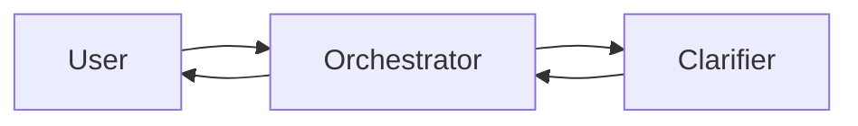
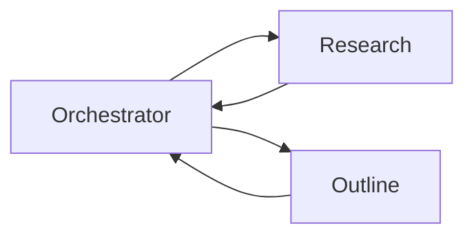
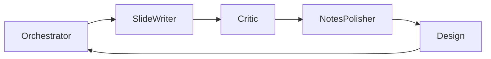

# PresentationPro A2A Orchestrator

A complete multi-agent orchestration service that coordinates presentation generation using the A2A (Agent-to-Agent) protocol.

## Architecture

The orchestrator implements a distributed microservices architecture where each specialized agent runs as an independent service communicating via the A2A protocol.

### Components

1. **Main Orchestrator** (`main.py`)
   - FastAPI application exposing REST endpoints
   - Manages the overall presentation workflow
   - Handles session management and state persistence

2. **Workflow Engine** (`workflow_engine.py`)
   - Orchestrates sequential and parallel agent execution
   - Implements retry logic with exponential backoff
   - Circuit breaker pattern for fault tolerance
   - Supports conditional and dynamic workflows

3. **Agent Discovery** (`agent_discovery.py`)
   - Dynamic agent discovery via .well-known/agent.json
   - Health monitoring and status tracking
   - Agent registry with capability indexing
   - Load balancing and failover support

4. **Session Manager** (`session_manager.py`)
   - Persistent session state across workflows
   - TTL-based session expiration
   - Result aggregation and error tracking
   - Export/import for session portability

5. **API Routes** (`api_routes.py`)
   - Extended REST endpoints for management
   - Telemetry and metrics collection
   - Configuration management
   - Diagnostic and debugging tools

## Connected Agents

The orchestrator coordinates the following specialized agents:

| Agent | Port | Purpose |
|-------|------|---------|
| Clarifier | 10001 | Refines presentation goals through conversation |
| Outline | 10002 | Generates presentation structure |
| SlideWriter | 10003 | Creates initial slide content |
| Critic | 10004 | Reviews and improves slides |
| NotesPolisher | 10005 | Polishes speaker notes |
| Design | 10006 | Creates visual designs |
| ScriptWriter | 10007 | Generates presentation scripts |
| Research | 10008 | Gathers background information |

## API Endpoints

### Core Workflow Endpoints

- `POST /v1/clarify` - Start clarification dialogue
- `POST /v1/outline` - Generate presentation outline
- `POST /v1/slide/write` - Generate individual slides
- `POST /v1/research/backgrounds` - Research topics
- `POST /v1/presentations/{session_id}/complete` - Finalize presentation

### Management Endpoints

- `GET /health` - Service health check
- `GET /v1/agents` - List discovered agents
- `GET /v1/sessions` - List active sessions
- `GET /v1/sessions/{session_id}` - Get session details
- `DELETE /v1/sessions/{session_id}` - Delete session

### Monitoring & Diagnostics

- `GET /v1/metrics` - System and performance metrics
- `POST /v1/telemetry` - Submit telemetry data
- `GET /v1/diagnostics/agents` - Agent connectivity tests
- `GET /v1/diagnostics/workflow` - Workflow integration test

## Deployment

### Docker Deployment

```bash
# Build the orchestrator image
docker build -t presentationpro-orchestrator .

# Run with Docker Compose (includes all agents)
docker-compose up -d

# Check health
curl http://localhost:8080/health
```

### Environment Variables

```env
# Required
GOOGLE_GENAI_API_KEY=your_api_key_here

# Optional
ORCHESTRATOR_PORT=8080
ENVIRONMENT=production
LOG_LEVEL=INFO

# Agent URLs (for custom deployments)
CLARIFIER_URL=http://clarifier:10001
OUTLINE_URL=http://outline:10002
# ... etc
```

### Standalone Development

```bash
# Install dependencies
pip install -r requirements.txt

# Run orchestrator
python -m uvicorn main:app --host 0.0.0.0 --port 8080 --reload
```

## Workflow Execution

### 1. Clarification Phase


### 2. Planning Phase (Parallel)


### 3. Slide Generation Pipeline


## Error Handling

### Circuit Breaker Pattern
- Prevents cascading failures
- Opens after 5 consecutive failures
- Recovery timeout: 60 seconds
- Half-open testing with 3 calls

### Retry Policy
- Maximum 3 attempts per agent call
- Exponential backoff: 1s, 2s, 4s
- Maximum delay: 30 seconds

### Graceful Degradation
- Optional agents can fail without stopping workflow
- Critical agents (Outline, SlideWriter) are required
- Fallback to cached or default responses

## Session Management

Sessions track the complete presentation generation lifecycle:

```python
{
    "id": "session-uuid",
    "state": "active|completed|error",
    "workflow_state": "clarifying|outlining|generating",
    "presentation_id": "presentation-uuid",
    "slides": {...},
    "usage": {...},
    "errors": [...]
}
```

### Session Lifecycle
1. **Created** - Initial state
2. **Active** - Processing workflow
3. **Completed** - Successfully finished
4. **Error** - Failed with errors
5. **Expired** - TTL exceeded

## Monitoring

### Health Checks
- Agent connectivity: Every 30 seconds
- Response time tracking
- Consecutive failure counting

### Metrics Collection
- Request counts and error rates
- Agent response times
- Session statistics
- Token usage aggregation

## Development

### Testing
```bash
# Run unit tests
pytest tests/

# Run integration tests
pytest tests/integration/

# Check agent connectivity
curl http://localhost:8080/v1/diagnostics/agents
```

### Adding New Agents

1. Implement A2A server with agent card
2. Add to AGENT_URLS configuration
3. Update workflow engine if needed
4. Register in docker-compose.yml

### Debugging

Enable debug mode:
```bash
ENVIRONMENT=development LOG_LEVEL=DEBUG python -m uvicorn main:app --reload
```

Access debug endpoints:
- `/v1/debug/sessions/{session_id}` - Full session state
- `/v1/debug/reset` - Reset orchestrator

## Performance

### Optimization Strategies
- Parallel agent execution where possible
- Connection pooling for HTTP clients
- Session caching with TTL
- Lazy agent discovery

### Scalability
- Stateless orchestrator design
- Horizontal scaling with load balancer
- External session store (Redis) support
- Agent auto-scaling based on load

## Security

### Best Practices
- API key authentication for agents
- CORS configuration for frontend
- Non-root Docker user
- Network isolation between services
- Rate limiting on endpoints

## License

Part of the PresentationPro project.